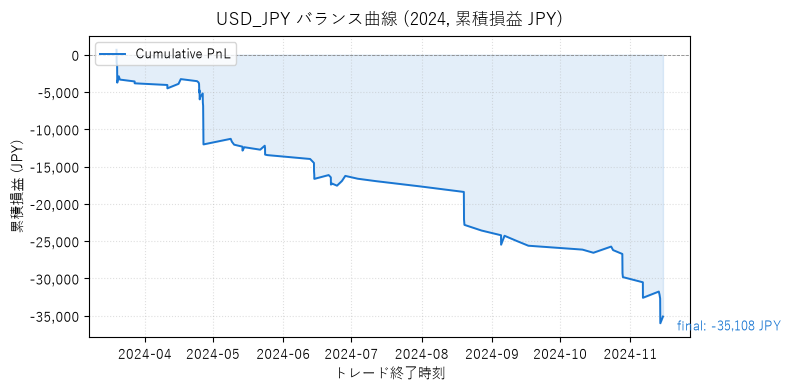
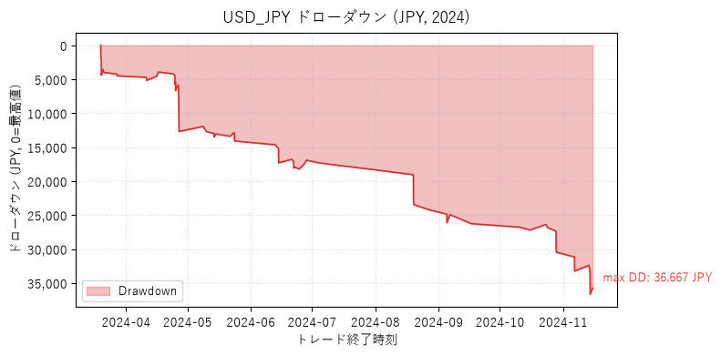

# 2024 USD/JPY バックテスト結果

!!! warning "本ページの数値は 2026-08-13 ラボ PJ 実行 (A1_A2_combined プリセット, スワップ未考慮) に基づきます"
    旧ページでは数値が USD/JPY ではなく AUD/JPY のものを誤って掲載していました (2026-08-14 修正)。

## サマリ

| 項目 | 値 |
|---|---|
| 戦略 | SYS-FX007 v2.1 |
| プリセット | A1_A2_combined (SL 1.5 ATR / Donchian 50 / ADX 20) |
| 期間 | 2024-01-01 〜 2024-12-31 (1 年) |
| 初期資金 | 1,000,000 JPY |
| 通貨ペア | USD/JPY |
| スプレッド | 0.3 pips |
| スリッページ | 0.5 pips |

## 結果

| 指標 | 値 | 判定 |
|---|---|---|
| トレード数 | 58 | — |
| 勝率 | 24.14% | — |
| シャープ (月次) | -2.879 | ❌ K1m 違反 (< 0.4) |
| Profit Factor | 0.327 | ❌ K1m 違反 (< 1.2) |
| 期待値 (JPY) | -327.92 | ❌ K1m 違反 (< 0) |
| 最大 DD (%) | 1.92 | ✅ K2m 合格 (≤ 10%) |
| 最大連続負 | 15 | ❌ K3m 違反 (> 5) |
| ペイオフレシオ | 1.026 | ❌ K4m 違反 (< 1.5) |
| 総損益 (JPY) | -19,019 | ❌ 赤字 |

## バランス曲線 / ドローダウン

`scripts/generate_charts.py` でラボ PJ の `trades-USD_JPY-2024.json` から生成。
現時点でラボ PJ に保存されているトレード履歴は **Base プリセット (130 トレード, PnL -35,108 JPY)** のみ。
A1_A2_combined プリセット (58 トレード) のトレードファイルはラボ PJ に未保存のため、
以下は参考チャートです (A1_A2_combined の数値とは別)。

> Base プリセット 130 トレード: 勝率 15.4%, PF 0.245, シャープ -3.876, 総損益 -35,108 JPY, max DD 36,668 JPY
>
> ※ ラボ PJ のトレード履歴保存スクリプト (`scripts/analyze_trades.py` 等) は最新プリセットでの再実行が未完了。
> A1_A2_combined 用のトレードファイル生成は差し戻し 3 完了後の予定。

## OBS000003 採用判定

**REJECT**

### 理由

1. **PF 0.327 < 1.0** (K1m 違反、期待値ベースで赤字)
2. **シャープ -2.879** (月次大幅マイナス、9 ヶ月連続赤字)
3. **ペイオフレシオ 1.026 < 1.5** (K4m 違反)
4. **最大連続負 15** (K3m 5 以下を大幅超過)
5. **USD/JPY 2024 は構造的にレンジ相場でブレイクが機能しなかった** 可能性
6. 期待値 -327.92 JPY は K5m 基準 (USD/JPY スプレッド往復 0.6 pips × 3 ≒ 180 JPY) を**下回る**どころか大幅マイナス

## USD/JPY 4 プリセット アブレーション

| プリセット | トレード数 | 勝率 | PF | シャープ | 総損益 (JPY) | DD% |
|---|---|---|---|---|---|---|
| Base | 130 | 15.4% | 0.245 | -3.876 | -35,108 | 3.58 |
| A1_SL_TP | 76 | 25.0% | 0.435 | -2.175 | -22,468 | 2.39 |
| A2_Donchian50 | 103 | 14.6% | 0.206 | -2.982 | -27,268 | 2.73 |
| **A1_A2_combined** | **58** | **24.1%** | **0.327** | **-2.879** | **-19,019** | **1.92** |
| A3_ADX30 | 31 | 16.1% | 0.129 | -1.082 | -13,274 | 1.38 |

**効果分離** (ラボ PJ 引き継ぎ §0 より):
- A1 (SL/TP 拡大): 勝率 +9.6 pt、PF +0.19 → **単独で最も効くレバー**
- A2 (Donchian 長期化): 勝率ほぼ変わらず、PF やや悪化 → 抜本的解決策にならない
- A1+A2 (複合): PnL/DD 最小の守りの構成だが黒字化未達
- A3 (ADX 30 強化): エントリー数 31 に激減、PF さらに悪化 → **見送り**

## 次のアクション

- [x] AUD/JPY で同条件検証 → **スワップ込みで黒字維持確認** (PF 1.99, シャープ 1.80, PnL +5,828)
- [ ] AUD/JPY を「保留」からの PROVISIONAL ACCEPT へ格上げ → train/val/test 分離検証 (差し戻し 3) 待ち
- [ ] USD/JPY 2023 / 2025 再評価 (時期尚早、優先度低)
- [ ] EUR/JPY, GBP/JPY は A1_A2_combined で検証済み (それぞれ赤字/微黒字)
